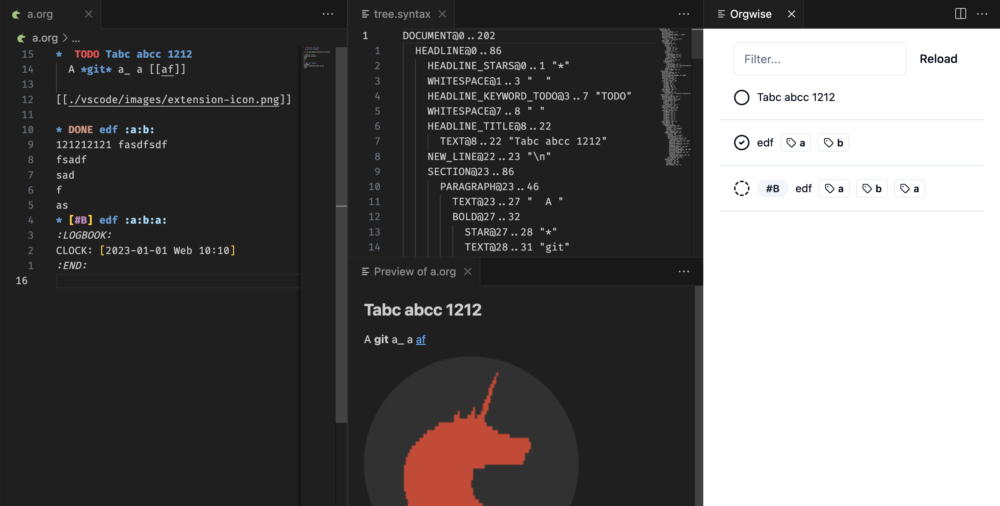

# `Orgwise`

Orgwise is a(n)

- language server / vscode extension
- command line utility
- api server / web interface

for org-mode files, builtin with [`orgize`].

[`orgize`]: https://crates.io/crates/orgize

## Development

Requires `Rust 1.26+` for async trait feature.
